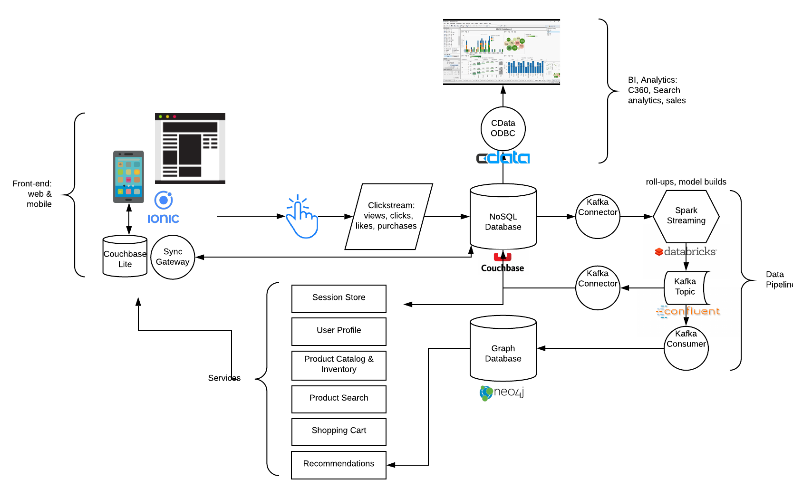

# Project Voltron

## Summary

This project aims to be a showcase for Couchbase Partner integrations. Each integration will contain a working demo and assets to help enable users understand the solution(s) and how to leverage them. Each integration also represents a piece of a larger, opinionated vertical solution when combined together (hence "Voltron").

## Architecture

## Use Cases

Services

- Session management
- User profile
- Product catalog & inventory
- Search
- Shopping Cart
- Recommendations

Back Office Features

- Customer 360
- Catalog analytics
- Search analytics

Machine Learning (potential applications)

- Collaborative filtering for recommendations
- Graph analysis for recommendations
- Product classification
- Customer segmentation

## Data Set

Options being explored:

- [Movie Lens](https://grouplens.org/datasets/movielens/)
- [IMDB](https://www.kaggle.com/lakshmi25npathi/imdb-dataset-of-50k-movie-reviews)

## Technologies

Full list TBD

- Couchbase
- OpenShift
- Kafka
- Spark
- Neo4j
- Ionic
- CData